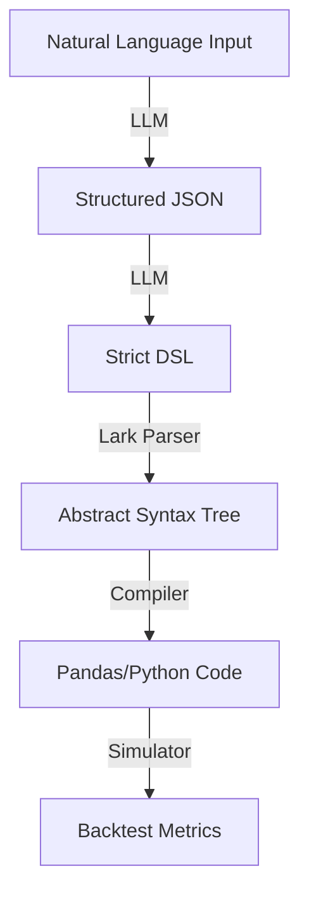

# LLM-Powered Trading Strategy Compiler

A robust pipeline that converts natural language trading strategies into executable code and runs backtests.

## Overview

This project bridges the gap between natural language and executable trading code.

**What it does:**
It allows you to describe trading strategies in plain English (e.g., _"Buy when the price crosses above the 20-day average"_), and it automatically:

1.  **Understands** your intent (using LLMs).
2.  **Compiles** it into a strict, safe mathematical representation (DSL/AST).
3.  **Backtests** it against historical data to tell you how much money it would have made (or lost).

Under the hood, it uses **Llama-3** to parse intent, but relies on a deterministic **Compiler** (Parser + AST) for execution, ensuring that the math is always correct and verifiable.

**Key Features:**

- **LLM-Driven Understanding**: Handles synonyms ("price" -> "close"), relative dates ("last week"), and complex logic.
- **Robust DSL**: Supports arithmetic (`volume * 1.5`), logical operators (`AND`/`OR`), and function-style or infix cross operators (`CROSS_ABOVE`).
- **Advanced Backtesting**: Calculates **Total Return %**, **Max Drawdown**, and tracks positions with a detailed trade log.
- **Safety**: Strict JSON intermediate layer ensures deterministic logic generation.

## Architecture



## Installation

1. **Clone the repository**
2. **Install dependencies**:
   ```bash
   pip install -r requirements.txt
   ```
3. **Set up API Key**:
   Create a `.env` file in the root directory:
   ```env
   GROQ_API_KEY=your_groq_api_key_here
   ```

## Usage

1. **Generate Data** (Optional, if you need sample data):

   ```bash
   python generate_sample_data.py
   ```

2. **Run the Demo**:

   ```bash
   python demo.py
   ```

3. **Enter a Strategy**:

   > "Buy when close is above the 20-day moving average OR volume is above 1 million. Exit when RSI(14) is below 30."

   **Output**:

   ```text
   Generated DSL:
   ENTRY:
   close > sma(close,20) OR volume > 1000000
   EXIT:
   rsi(close,14) < 30

   Backtest Result:
   Total Return: 93.6%
   Max Drawdown: -3.1%
   Trades: 4
   ```

## DSL Syntax

The compiler automatically generates this from your natural language, but here is the underlying syntax:

- **Logic**: `AND`, `OR`
- **Comparators**: `>`, `<`, `>=`, `<=`, `==`, `CROSS_ABOVE`, `CROSS_BELOW`
- **Arithmetic**: `+`, `-`, `*`, `/`
- **Functions**: `sma(field, window)`, `rsi(field, window)`
- **Variables**: `open`, `high`, `low`, `close`, `volume` (and suffixes `_yesterday`, `_last_week`)

## Project Structure

```text
.
├── demo.py                  # Main entry point (CLI)
├── nl_to_dsl.py             # LLM chain (NL -> JSON -> DSL)
├── dsl_grammar.lark         # Formal grammar definition
├── parser.py                # Lark parser initialization
├── ast_builder.py           # Transforms Parse Tree -> AST
├── ast_nodes.py             # AST Node Definitions
├── ast_to_python.py         # Compiles AST -> Pandas Series
├── simulator.py             # Backtesting engine
├── llm_client.py            # Groq API client
└── requirements.txt         # Dependencies
```

## Author

Created for Rootaly AI Assignment.
